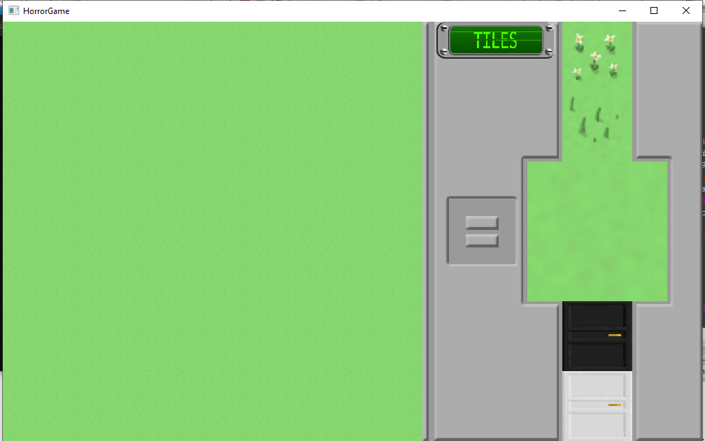
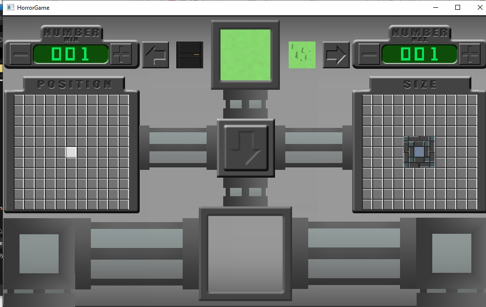
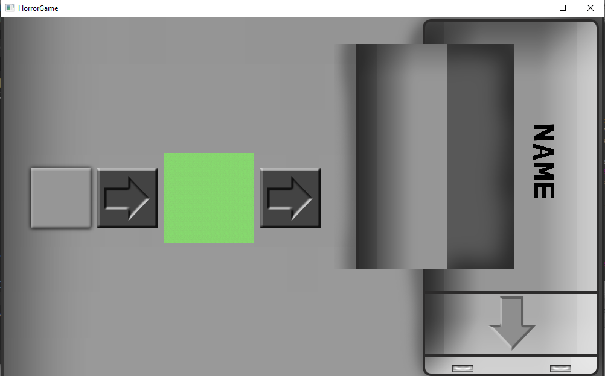
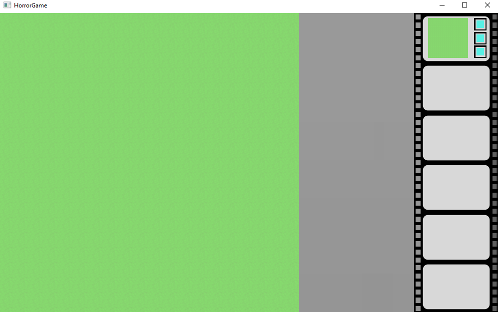
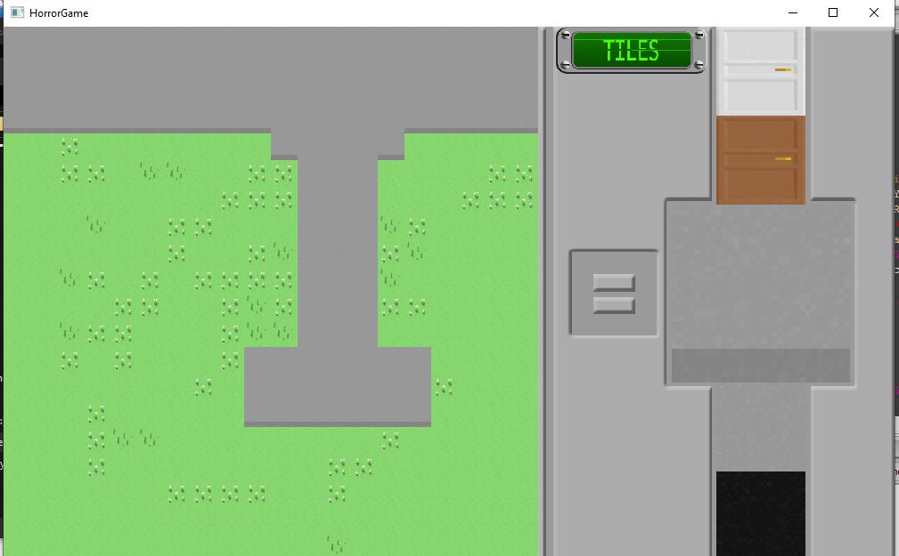
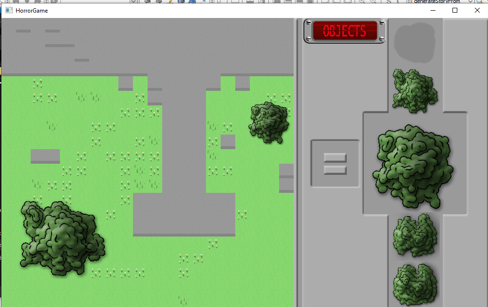
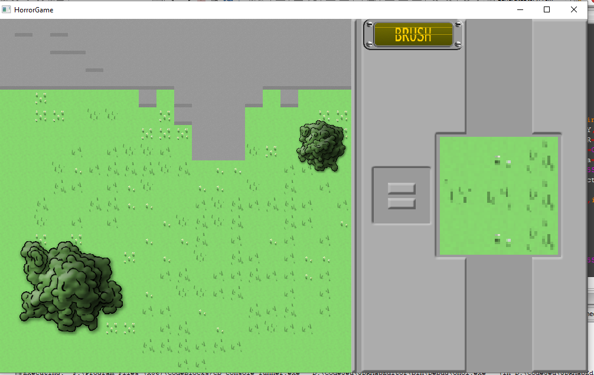
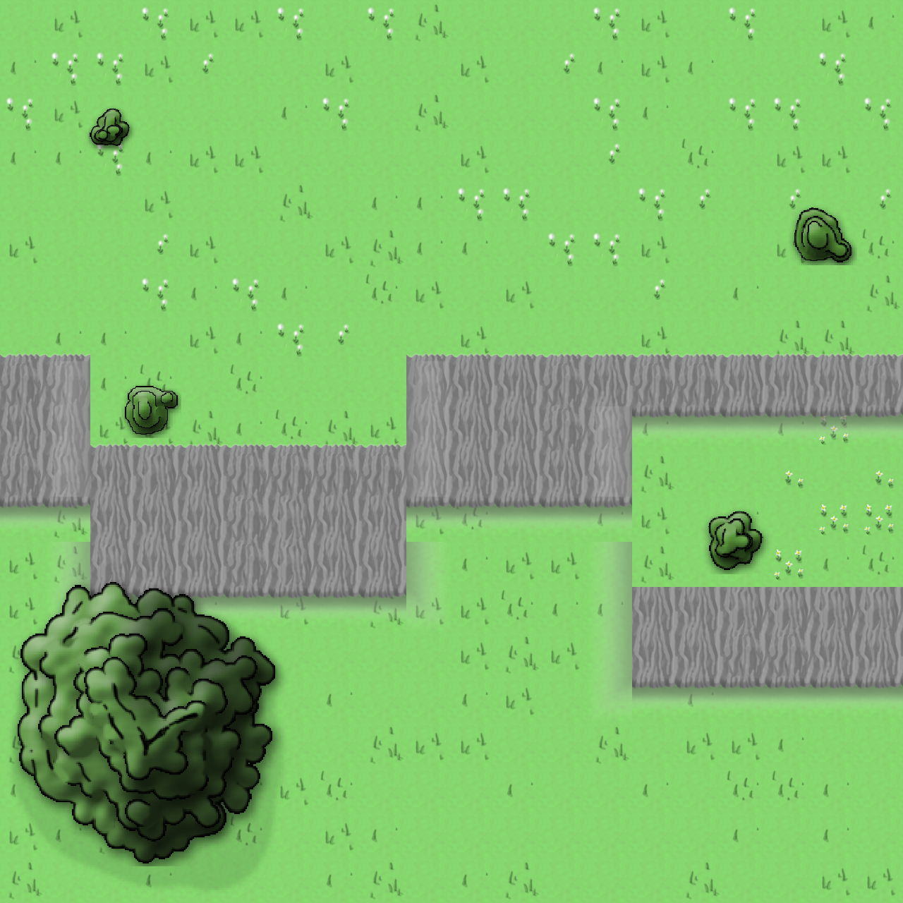
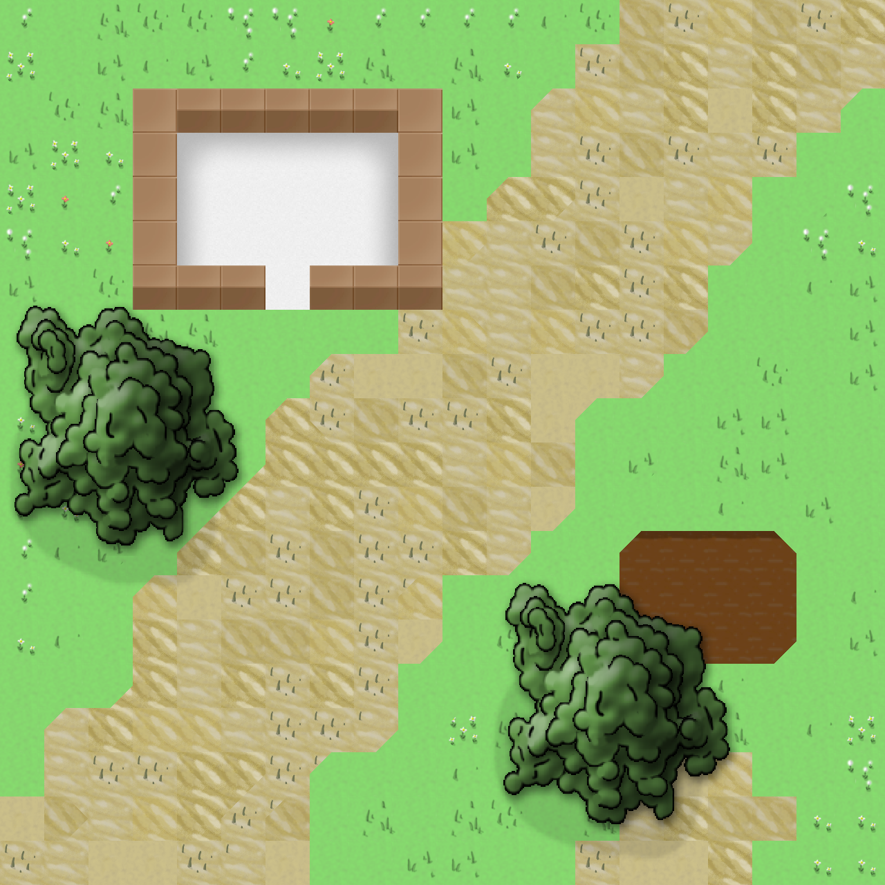

# JDRMapEditor
C++ JDRMapEditor with fancy and overanimated interface
## Images
### Screenshot

### Exemple Result

## Controls
Space - Switch mode
P - Screenshot
O - Screenshot menu
I - Brush menu
U - Save/Load menu
A - Switch between Floor/Roof/RoundingSelector
Tab - Active/Deactive Rounding Mode
### In Objects Mode
S - Resize
M - Move
R - Rotate
N - Create Object
L - Superposition Level
C - Clone Selected
Backspace - Remove Selected